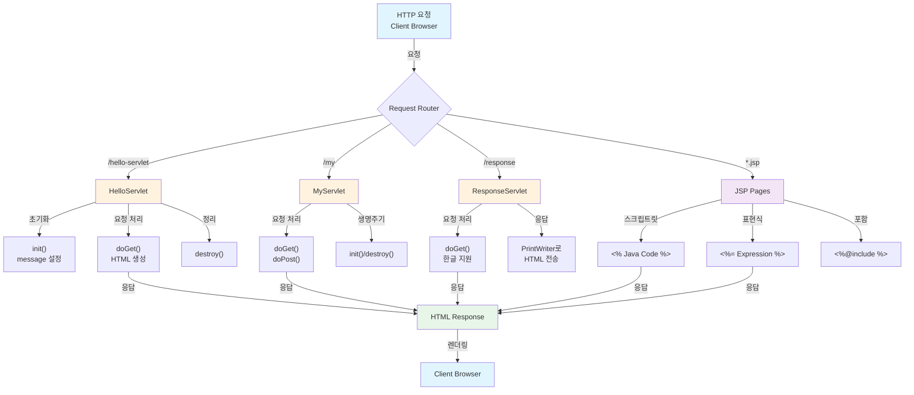
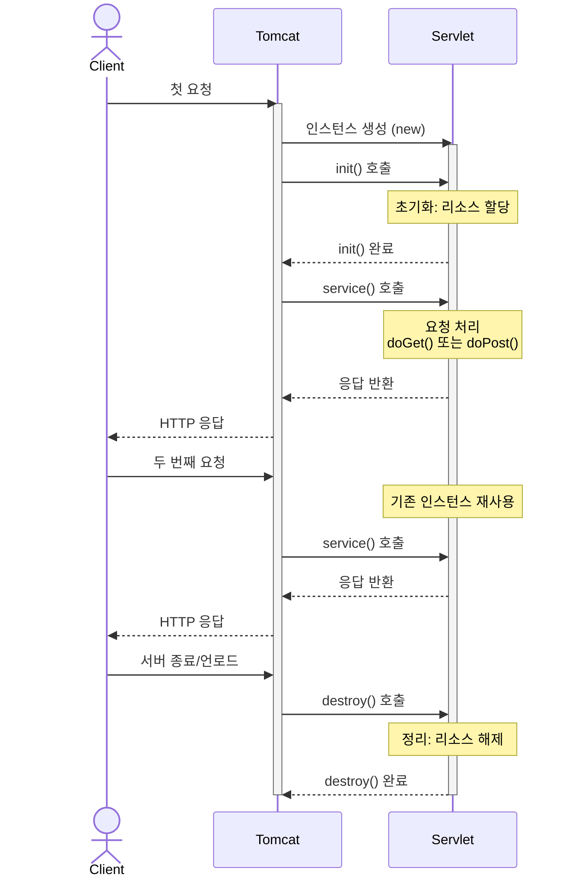
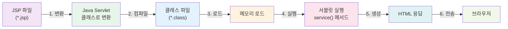

# 📚 ex02 - Java Servlet & JSP Web Application

> Java Servlet과 JSP를 이용한 웹 애플리케이션 학습 프로젝트

## 📋 프로젝트 개요

이 프로젝트는 Java의 Servlet과 JSP(JavaServer Pages)를 활용하여 동적 웹 애플리케이션을 개발하는 방법을 학습하는 프로젝트입니다.

**주요 기술 스택:**
- ☕ **Java 93.3%**
- 🌐 **HTML 6.7%**
- 🚀 **Servlet**: HTTP 요청 처리 및 동적 응답 생성
- 📄 **JSP**: 서버 사이드 템플릿 엔진으로 HTML 생성

---

## 🏗️ 프로젝트 아키텍처



---

## 📁 프로젝트 구조

```
ex02/
├── src/main/
│   ├── java/
│   │   └── org/scoula/ex2/
│   │       ├── HelloServlet.java      ⭐ 기본 Servlet 예제
│   │       ├── MyServlet.java         ⭐ 생명주기 관리
│   │       └── ResponseServlet.java   ⭐ 한글 처리
│   │
│   └── webapp/
│       ├── WEB-INF/
│       │   └── web.xml               📋 배포 설명자
│       ├── index.jsp                 🏠 메인 페이지
│       ├── main.jsp                  📄 JSP 학습 페이지
│       ├── login.jsp                 🔐 로그인 예제
│       ├── loginForm.html            📝 로그인 폼
│       ├── request.jsp               📨 요청 처리
│       ├── response.jsp              📤 응답 처리
│       ├── count.jsp                 🔢 카운팅
│       ├── divide.jsp                ➗ 나눗셈 계산
│       ├── error.jsp                 ⚠️ 에러 처리
│       ├── session_product.jsp       🛒 세션 예제
│       ├── loginInfo.jsp             👤 로그인 정보
│       ├── loginInfo2.jsp            👤 로그인 정보 2
│       ├── out.jsp                   📋 출력 예제
│       └── copyright.jsp             © 저작권 정보
```

---

## 🔧 핵심 컴포넌트 분석

### 1️⃣ **Servlet 클래스들**

#### **HelloServlet.java** - 기본 Servlet 예제
```java
package org.scoula.ex2;

import java.io.*;
import javax.servlet.http.*;
import javax.servlet.annotation.*;

public class HelloServlet extends HttpServlet {
    private String message;

    public void init() {
        message = "Hello World!";
    }

    public void doGet(HttpServletRequest request, HttpServletResponse response) throws IOException {
        response.setContentType("text/html");
        System.out.println("doGet호출됨. ===========================");

        PrintWriter out = response.getWriter();
        out.println("<html><body>");
        out.println("<h1>" + message + "</h1>");
        out.println("</body></html>");
    }

    public void destroy() {
    }
}
```

**📝 설명:**
- Servlet의 기본 생명주기 메서드 구현: `init()`, `doGet()`, `destroy()`
- `init()`: 서블릿 초기화 시 호출, 리소스 초기화
- `doGet()`: HTTP GET 요청 처리
- `destroy()`: 서블릿 소멸 시 호출, 리소스 정리

#### **MyServlet.java** - Servlet 생명주기 관리
```java
@WebServlet(name = "my", value = "/my")
public class MyServlet extends HttpServlet {
    @Override
    protected void doGet(HttpServletRequest req, HttpServletResponse resp) 
            throws ServletException, IOException {
        System.out.println("doGet 호출됨. ==============================");
    }

    @Override
    protected void doPost(HttpServletRequest req, HttpServletResponse resp) 
            throws ServletException, IOException {
        super.doPost(req, resp);
    }

    @Override
    public void destroy() {
        System.out.println("서블릿 제거되기 전에 꼭 실행할 부분 코드");
    }

    @Override
    public void init() throws ServletException {
        System.out.println("서블릿 생성될 때 꼭 초기화할 부분 코드");
    }
}
```

**📝 설명:**
- `@WebServlet` 어노테이션으로 URL 매핑
- `doGet()`: GET 요청 처리
- `doPost()`: POST 요청 처리
- 생명주기 메서드 오버라이드를 통한 로깅

#### **ResponseServlet.java** - 한글 처리 및 응답
```java
@WebServlet("/response")
public class ResponseServlet extends HttpServlet {
    @Override
    protected void doGet(HttpServletRequest req, HttpServletResponse resp) 
            throws ServletException, IOException {
        System.out.println("get요청됨....... ");
        resp.setContentType("text/html;charset=UTF-8"); // 한글 지원
        PrintWriter out = resp.getWriter();
        out.println("<html><body>");
        out.println("<h1>나는 서블릿으로부터 도착함.</h1>");
        out.println("</body></html>");
    }
}
```

**📝 설명:**
- `charset=UTF-8`을 통한 한글 인코딩 처리
- 클라이언트에게 HTML 응답 전송

---

### 2️⃣ **JSP 페이지들**

#### **index.jsp** - 메인 입구
```jsp
<%@ page contentType="text/html; charset=UTF-8" pageEncoding="UTF-8" %>
<!DOCTYPE html>
<html>
<head>
    <title>JSP - Hello World</title>
</head>
<body>
    <a href="hello-servlet">Hello Servlet</a>
</body>
</html>
```

#### **main.jsp** - JSP 문법 학습
```jsp
<%@ page import="java.util.Date" %>
<%@ page contentType="text/html;charset=UTF-8" language="java" %>
<html>
<head>
    <title>Title</title>
</head>
<body>
<%
    // 스크립트릿(Scriptlet): Java 코드 작성
    int count = 0;
    count = 100;
%>

<!-- 표현식(Expression): 변수/식의 값 출력 -->
<h1> <%= count %> </h1>

<!-- JSP 자바 주석: 브라우저에 전송되지 않음 -->
<%-- 이것은 JSP 주석입니다 --%>

<!-- HTML 주석: 브라우저에 전송됨 -->
<!-- 이것은 HTML 주석입니다 -->

<%
    // 제어문 사용
    int sum = 10;
    if(sum >= 10) {
%>
        <h1>합이 매우 커요</h1>
<%
    } else {
%>
        <h1>합이 적어요.</h1>
<%
    }
%>

<%
    // Date 객체 사용
    Date date = new Date();
    int hour = date.getHours();
    int min = date.getMinutes();
    int sec = date.getSeconds();
%>
<h1>현재 시각입니다.</h1>
<h1> <%= hour %>시 <%= min %>분 <%= sec %>초</h1>

<%
    // out 내장 객체 사용
    int sum2 = 10;
    if(sum2 >= 10) {
        out.print("<h1>합이 매우 커요</h1>");
    } else {
        out.print("<h1>합이 적어요.</h1>");
    }
%>
</body>
</html>
```

---

### 3️⃣ **배포 설정**

#### **web.xml** - Deployment Descriptor
```xml
<?xml version="1.0" encoding="UTF-8"?>
<web-app xmlns="http://xmlns.jcp.org/xml/ns/javaee"
         xmlns:xsi="http://www.w3.org/2001/XMLSchema-instance"
         xsi:schemaLocation="http://xmlns.jcp.org/xml/ns/javaee 
         http://xmlns.jcp.org/xml/ns/javaee/web-app_4_0.xsd"
         version="4.0">

    <servlet>
        <servlet-name>helloServlet</servlet-name>
        <servlet-class>org.scoula.ex2.HelloServlet</servlet-class>
    </servlet>
    <servlet-mapping>
        <servlet-name>helloServlet</servlet-name>
        <url-pattern>/hello-servlet</url-pattern>
    </servlet-mapping>

</web-app>
```

**📝 설명:**
- `<servlet>`: 서블릿 클래스 등록
- `<servlet-mapping>`: URL 패턴과 서블릿 연결

---

## 📊 컴포넌트 비교표

### Servlet 클래스 비교

| 항목 | HelloServlet | MyServlet | ResponseServlet |
|------|-------------|-----------|-----------------|
| **URL 패턴** | `/hello-servlet` | `/my` | `/response` |
| **매핑 방식** | web.xml | @WebServlet | @WebServlet |
| **GET 요청** | ✅ | ✅ | ✅ |
| **POST 요청** | ❌ | ✅ | ❌ |
| **한글 지원** | ❌ | ❌ | ✅ |
| **응답 타입** | text/html | - | text/html |
| **생명주기 로깅** | ❌ | ✅ | ❌ |

### JSP 페이지 기능 분류

| 기능 | 페이지 | 설명 |
|------|--------|------|
| **동적 계산** | count.jsp, divide.jsp | 수식 계산 및 결과 출력 |
| **인증 처리** | login.jsp, loginForm.html | 로그인 폼과 검증 |
| **정보 표시** | loginInfo.jsp, loginInfo2.jsp | 사용자 정보 표시 |
| **세션 관리** | session_product.jsp | 세션 기반 상품 정보 |
| **요청 처리** | request.jsp | 요청 파라미터 분석 |
| **응답 처리** | response.jsp | 응답 생성 및 전송 |
| **오류 처리** | error.jsp | 에러 페이지 |
| **학습용** | main.jsp | JSP 문법 및 내장 객체 |

---

## 🎯 Servlet 생명주기 흐름



---

## 📌 JSP 처리 흐름



---

## 🚀 JSP 주요 문법

### 스크립트릿 (Scriptlet)
```jsp
<% 
    // Java 코드 작성
    int x = 10;
    String name = "Korean";
%>
```

### 표현식 (Expression)
```jsp
<%= x %>                    <!-- 변수 출력 -->
<%= "Hello " + name %>      <!-- 식 계산 및 출력 -->
```

### 지시어 (Directive)
```jsp
<%@ page import="java.util.*" %>
<%@ page contentType="text/html; charset=UTF-8" %>
<%@ include file="header.jsp" %>
```

### 주석 (Comments)
```jsp
<%-- JSP 주석: 브라우저에 전송 안 됨 --%>
<!-- HTML 주석: 브라우저에 전송됨 -->
```

### 내장 객체 (Implicit Objects)
```jsp
<% 
    out.print("출력");           // PrintWriter
    String param = request.getParameter("name");  // HttpServletRequest
    response.setContentType("text/html");         // HttpServletResponse
%>
```

---

## 🔐 보안 및 인코딩

| 항목 | 설정 | 목적 |
|------|------|------|
| **문자 인코딩** | `charset=UTF-8` | 한글 깨짐 방지 |
| **Content-Type** | `text/html` | MIME 타입 지정 |
| **XSS 방지** | `out.print()` | 스크립트 태그 안전 처리 |
| **세션 관리** | `session` 객체 | 사용자 상태 유지 |

---

## 💡 학습 포인트

### ✅ Servlet 학습 목표
- [x] Servlet 기본 구조 이해
- [x] 생명주기 메서드 (init, doGet, doPost, destroy)
- [x] HttpRequest/HttpResponse 처리
- [x] 한글 인코딩 처리
- [x] @WebServlet 어노테이션 사용

### ✅ JSP 학습 목표
- [x] JSP 문법 (스크립트릿, 표현식, 지시어)
- [x] 내장 객체 (request, response, out, session)
- [x] 페이지 포함 (`<%@include %>`)
- [x] 동적 HTML 생성
- [x] 폼 데이터 처리

---

## 📚 참고 자료

- [Java Servlet API Documentation](https://docs.oracle.com/javaee/7/api/javax/servlet/package-summary.html)
- [JSP 2.3 Specification](https://projects.eclipse.org/projects/ee4j.jsp)
- [Apache Tomcat Documentation](https://tomcat.apache.org/tomcat-10.0-doc/)

---

## 👨‍💻 개발 환경

- **JDK**: Java 8 이상
- **Servlet API**: 4.0
- **WAS**: Apache Tomcat 9.0+
- **IDE**: IntelliJ IDEA / Eclipse

---

<br>


